# Handoff: DocsBuddy — Local-First Architecture

> **For the developer / Claude Code session that picks this up.** This bundle is a frozen snapshot of the design and architecture decisions made before any Flutter code was written. Read this README end-to-end before opening a file. Everything else is supporting material.

---

## 1. Overview

**DocsBuddy** is a family-shared mobile app that tracks physical assets (vehicles, appliances, electronics, documents) and reminds you about their due dates — insurance renewals, AMC, pollution checks, warranty expiries, etc.

The core promise: **never miss a renewal**, even if the network is down or the user has swapped devices. To deliver that promise, we've committed to a **local-first architecture** modelled on WhatsApp's sync behaviour: the phone is the source of truth, the server is a fan-out/backup target.

**Stack** (decided):
- Mobile: **Flutter** (single codebase, iOS + Android)
- Local DB: **Drift** (typed SQLite)
- State: **Riverpod 2.x** (with code-gen)
- Routing: **go_router**
- Backend: **Supabase** (Postgres + Auth + Storage + Edge Functions + Realtime)
- Push: **firebase_messaging** (silent data pushes only) + **flutter_local_notifications** (the actual user-facing alerts)
- Secure storage: **flutter_secure_storage** (Keychain / Keystore)

## 2. About the Design Files

The files in this bundle are **design references created in HTML** — a written architecture blueprint and a set of hi-fi iOS screen mockups laid out on a design canvas. They are **not production code to copy directly**.

Your job is to **recreate these designs in a real Flutter codebase** using the stack listed in §1 and the patterns described in this README. The HTML mockups exist to communicate visual intent, layout, and copy — translate them into Flutter widgets using `flutter_riverpod`, `go_router`, Material 3 widgets, and the design tokens listed in §9.

**Fidelity:** The screen mockups are **high-fidelity** (final colors, typography, spacing, copy). The blueprint document is implementation-grade — schemas, function pseudocode, file structure, and trade-off notes are all final and have been signed off.

## 3. The One Decision That Drives Everything: LOCAL-FIRST

We are **explicitly choosing the local-first variant** described in `DocsBuddy Architecture.html` (toggle `mode: "local"` in that file's tweaks). Concretely this means:

| | Server-driven (rejected) | **Local-first (chosen)** |
|---|---|---|
| Source of truth | Postgres | **Device SQLite (Drift)** |
| Who schedules notifications? | Daily server cron computes who to notify, sends FCM push | **The device** computes thresholds and schedules OS-level local notifications |
| Server's role | Orchestrator | **Sync target** + silent-push trigger to wake other devices |
| Offline behaviour | Degraded | **Identical to online** — all writes go to Drift first |
| Conflicts | Don't happen (last writer to server wins) | **Last-write-wins per field**, with tombstones for deletes |
| Files | Always proxied via signed URLs | **Hashed + chunked + resumable**, row arrives before bytes |

If at any point an implementation decision conflicts with this principle — **the principle wins**. Do not introduce server-side cron jobs that send user-facing pushes. Do not block UI on network writes. Do not assume the server has a coherent view of any reminder before sync runs.

## 4. Data Model

### 4.1 Server (Postgres / Supabase)

The Postgres schema is the canonical backup + sync target. See `DocsBuddy Architecture.html` §2 and §3 for full DDL. Tables:

- `users` — mirrors `auth.users`, adds `display_name`, `avatar_url`, `timezone`, `locale`
- `user_devices` — one row per (user, FCM token, platform). Unique on `(user_id, fcm_token)`
- `families` — `id`, `name`, `owner_id`
- `family_members` — composite PK `(family_id, user_id)`, role enum: `owner | admin | member | viewer`
- `family_invites` — short code, 7-day expiry, deep-link target
- `locations` — self-referencing tree (`parent_id`), `kind` enum: `home | office | vehicle | room | shelf | custom`
- `asset_categories` — slug, name, icon, `default_dates` JSONB, `schema` JSONB (declares per-category form fields)
- `assets` — `family_id`, `location_id`, `category_id`, plus `name`, `brand`, `model`, `serial_no`, `purchase_date`, `purchase_price`, `metadata` JSONB
- `asset_dates` — the *reminders* table. `due_date`, `recurrence` enum (`none | monthly | quarterly | half_yearly | yearly`), `notify_offsets int[]` (default `{30,7,1}`), `last_notified_offset`, `completed_at`
- `documents` — `family_id`, `asset_id`, `asset_date_id?`, `kind` enum, `storage_path`, `mime_type`, `size_bytes`, `thumb_path`
- `notification_prefs` — `channels text[]` (`push | local | email | whatsapp`), `default_offsets`, `quiet_start`, `quiet_end`

**Row Level Security:** Every multi-tenant table has policies built around a single helper function `is_family_member(family_id, min_role)` that joins `family_members` against `auth.uid()`. Storage bucket `docsbuddy-files/` enforces the same via `storage.foldername(name)[1]::uuid`.

### 4.2 Device (Drift / SQLite)

Drift tables mirror the server schema **plus sync fields**. Every syncable row carries:

```dart
IntColumn       get version    => integer().withDefault(const Constant(0))();   // monotonic per-row
TextColumn      get syncStatus => text().withDefault(const Constant('dirty'))(); // dirty | syncing | clean
DateTimeColumn  get updatedAt  => dateTime()();
DateTimeColumn  get deletedAt  => dateTime().nullable()();                       // tombstone
TextColumn      get fieldVersions => text().withDefault(const Constant('{}'))(); // per-field stamps for LWW merge
```

The two tables called out explicitly in the blueprint (`LocalReminders`, `LocalDocuments`) are the gold standard — model the others after them.

**`LocalDocuments` has additional file-sync fields:**
- `sha256` — for cross-family dedup before upload
- `localPath` (nullable) — null until downloaded
- `remotePath` (nullable) — null until uploaded
- `uploadState` — `queued | uploading | uploaded`
- `uploadedBytes` — for resumable PUT

### 4.3 Outbox

A dedicated `outbox` table holds pending mutations. Every write goes:

1. **Write to feature table** (e.g. `local_reminders`) with `syncStatus = 'dirty'`
2. **Append to outbox** with the operation (`insert | update | delete`), target table, row ID, and serialized diff
3. Background isolate drains the outbox into the network in order

This is the "WAL" for sync — never bypass it for mutations that need to reach the server.

## 5. Sync Pipeline

Triggered: app foreground, network regain, silent FCM ping, every ~15 min via `workmanager`.

Order (always):

```
01  Push outbox    →  flush dirty rows to server
02  Pull deltas    →  GET rows where server_updated_at > last_sync_at
03  Resolve        →  per-field LWW (server_field_versions vs incoming_field_versions)
04  Files          →  chunked upload of queued bytes, lazy download for changed rows
05  Reschedule     →  cancel & re-arm OS-level local notifications for the next ~30 days
```

**Conflict resolution** runs on the server in a transaction. Pseudocode is in §5.4 of the architecture doc. The key invariant: **tombstones (`deleted_at`) always win** against any concurrent edit. Deletes are sticky for 30 days, then garbage-collected.

**Files:** the row syncs first (small, fast). Bytes follow. Other family members see a placeholder thumbnail until the body arrives. SHA-256 dedup means uploading the same warranty PDF twice across the family just creates a second link row, no second body upload.

## 6. Notification Strategy

**The server never schedules user-facing pushes. Re-read that.**

When a reminder is created or edited locally, `services/reminder_scheduler.dart` computes every threshold date (`dueDate - notifyOffsets[i]`), filters out anything in the past, and schedules one OS notification per threshold via `flutter_local_notifications.zonedSchedule()` at **08:00 local time** of the threshold day.

```dart
Future<void> rescheduleFor(Reminder r) async {
  await _plugin.cancelAll(tag: 'r:${r.id}');
  for (final offset in r.notifyOffsets) {
    final when = r.dueDate.subtract(Duration(days: offset));
    if (when.isBefore(DateTime.now())) continue;
    await _plugin.zonedSchedule(
      id: stableInt(r.id, offset),
      tzTime: tz.TZDateTime.from(when, tz.local).withHour(8),
      title: '${r.assetName} — ${r.label} in $offset days',
      body:  'Due ${formatDate(r.dueDate)}',
      payload: 'docsbuddy://asset/${r.assetId}',
      tag: 'r:${r.id}',
      androidScheduleMode: AndroidScheduleMode.exactAllowWhileIdle,
    );
  }
}
```

iOS and Android cap scheduled local notifications at ~64 per app. We only queue the next ~30 days at a time; a weekly `workmanager` task re-fills the queue.

**FCM is used only for silent data pushes** (`content-available: 1` on iOS, `data`-only on Android) that wake the app to run a sync when *another family member* made a change. Whether to show a notification after that sync is the device's decision, not the server's.

## 7. Folder Structure

Use this structure exactly — every feature folder has the same `data / application / presentation` triple:

```
lib/
  main.dart
  app.dart                              # MaterialApp + GoRouter + ProviderScope
  core/
    config/      env.dart, flavors.dart
    theme/       colors.dart, text_styles.dart, app_theme.dart
    errors/      failure.dart, exception.dart
    network/     supabase_client.dart, interceptors.dart
    storage/     secure_storage.dart, key_value.dart
    utils/       date_x.dart, result.dart, logger.dart
    widgets/     primary_button.dart, loading_state.dart, empty_state.dart
  data/
    local/       app_database.dart, daos/...
    models/      user.dart, family.dart, asset.dart, ... (freezed)
  features/
    auth/        data/ application/ presentation/
    family/      data/ application/ presentation/
    locations/   data/ application/ presentation/
    assets/      data/ application/ presentation/
    documents/   data/ application/ presentation/
    reminders/   data/ application/ presentation/
    notifications/ data/ application/ presentation/
    sync/        data/ application/        # outbox drain, delta pull, conflict merge
  routing/
    app_router.dart                       # GoRouter config, deep links, guards
    routes.dart
test/                                     # mirror lib/ structure
```

**Repository pattern (the seam between Drift and Supabase):**

1. **Read** — UI subscribes to a Drift `Stream<List<T>>`. Latest local data renders immediately.
2. **Write** — Mutation hits Drift + outbox in the same transaction. UI updates instantly. Outbox drain attempts the remote write; on failure, retries with exponential backoff.
3. **Sync** — Repository upserts deltas from Supabase into Drift on a schedule. Realtime channels can shortcut this on hot data.

Example provider:

```dart
@riverpod
class UpcomingReminders extends _$UpcomingReminders {
  @override
  Stream<List<ReminderView>> build() {
    final repo = ref.watch(reminderRepositoryProvider);
    return repo.watchUpcoming(within: const Duration(days: 90));
  }

  Future<void> markDone(String id) async {
    await ref.read(reminderRepositoryProvider).markCompleted(id);
  }
}
```

## 8. Screens

The 21 designed screens live in `DocsBuddy Screens.html` (a design canvas — drag to reorder, double-click any artboard to focus). Each is an iPhone frame at **390×780**. Organized into four sections:

### Onboarding (first launch only — shown when no session exists)
| # | Name | Preview | Purpose |
|---|---|---|---|
| 00a | Welcome | 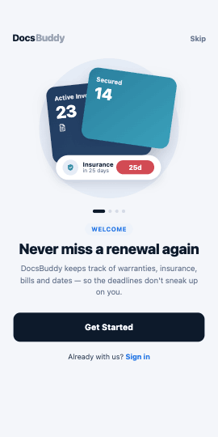 | Brand intro, "Get Started" CTA |
| 00b | Track Assets | 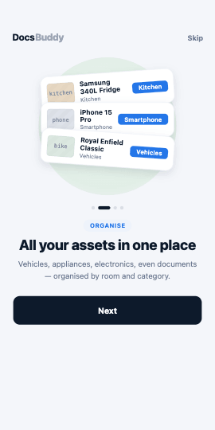 | Value-prop slide — hierarchical asset tracking |
| 00c | Smart Reminders | 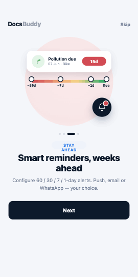 | Value-prop slide — 30/7/1 day nudges |
| 00d | Family Sharing | 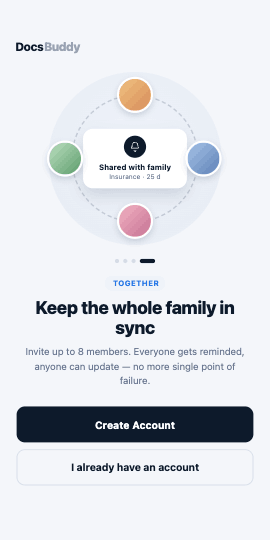 | Value-prop slide — multi-user families |

### Asset & reminder flow (the core product)
| # | Name | Preview | Purpose |
|---|---|---|---|
| 01 | Dashboard | 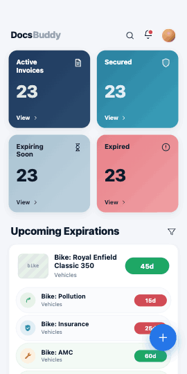 | Upcoming reminders feed (DayPill + IconBubble per row), quick stats |
| 02 | Rooms | 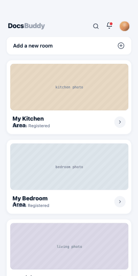 | Top-level locations grid (cards with image + asset count) |
| 03 | Room Detail | 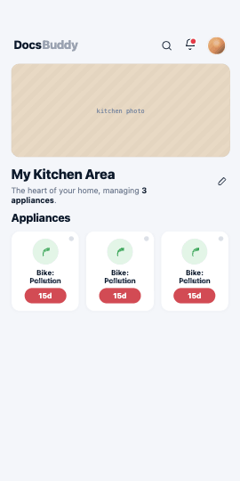 | One room's contents — sub-locations + assets |
| 04 | Asset List | 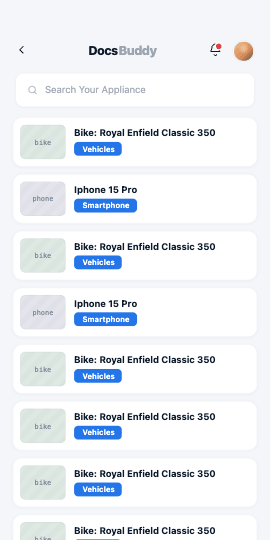 | Flat list of all assets in a family or location, filterable by category |
| 05 | Appliance Picker | 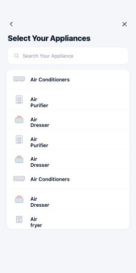 | Category chooser when adding a new asset (vehicle / appliance / electronics / …) |
| 06 | Add Appliance | 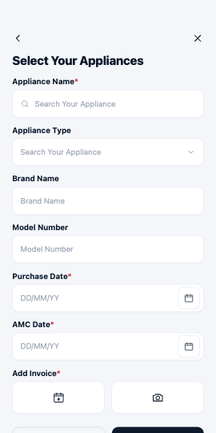 | Dynamic form rendered from `asset_categories.schema` |
| 07 | Asset Detail | 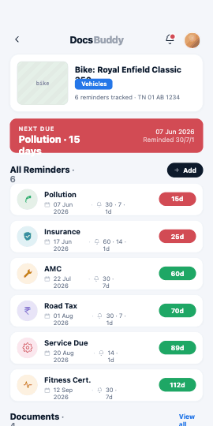 | One asset — purchase info, dates, documents, history |
| 08 | Add Reminder | 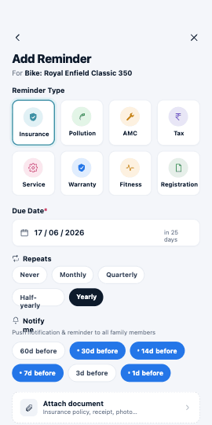 | Set a `label`, `due_date`, `recurrence`, `notify_offsets` |

### Authentication
| # | Name | Preview |
|---|---|---|
| 09 | Sign In | 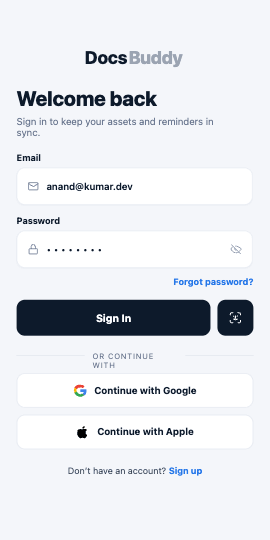 |
| 10 | Sign Up | 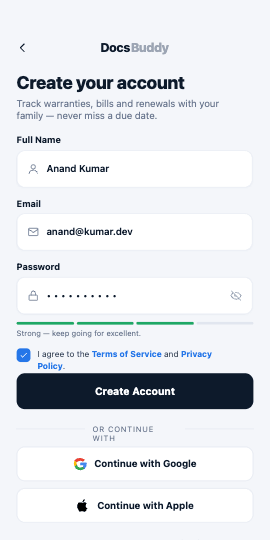 |
| 11 | Forgot Password | 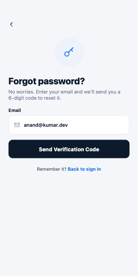 |
| 12 | OTP Verification | 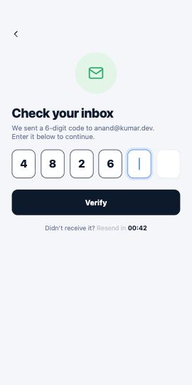 |
| 13 | Reset Password | 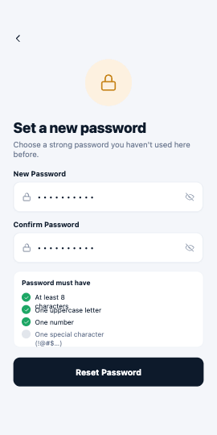 |

### User & settings
| # | Name | Preview |
|---|---|---|
| 14 | Profile | 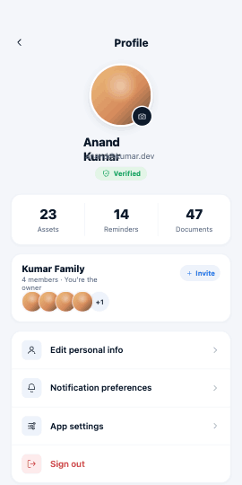 |
| 15 | Settings | 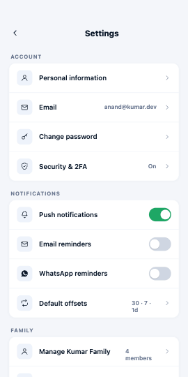 |
| 16 | Change Password | 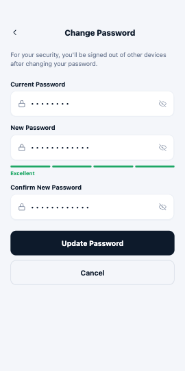 |
| 17 | Security & 2FA | 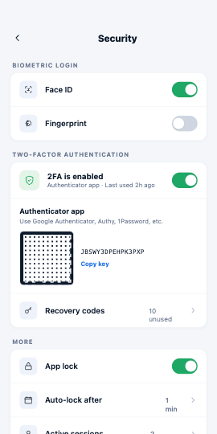 |

Thumbnails above are 270×540 reference shots. **For pixel-accurate visuals, open `DocsBuddy Screens.html`** in a browser — that's the interactive canvas at full 390×780 resolution with pan/zoom and focus mode.

## 9. Design Tokens

All exact values lifted from `screens/shared.jsx` and the architecture doc's CSS variables. Use these literally in `core/theme/colors.dart` and `core/theme/text_styles.dart`.

### Colors

```dart
// neutrals
static const bg      = Color(0xFFF4F6FA);
static const paper   = Color(0xFFFFFFFF);
static const ink     = Color(0xFF0D1A2B);  // primary text
static const ink2    = Color(0xFF324159);  // secondary text
static const muted   = Color(0xFF6B7891);  // tertiary / metadata
static const line    = Color(0xFFE7EBF2);  // borders / dividers
static const line2   = Color(0xFFEEF1F6);  // softer dividers

// brand
static const navy    = Color(0xFF1F3A5F);  // architecture cover gradient start
static const teal    = Color(0xFF2A7F9E);  // architecture cover gradient end, section accents
static const chipBlue = Color(0xFF2476E8); // category chips

// semantic
static const green   = Color(0xFF1EA765);  // "30d+ to go" pill
static const red     = Color(0xFFD24B54);  // overdue / urgent pill
static const amber   = Color(0xFFD8901A);  // warning
```

### Reminder-type palette (used for `IconBubble` colors)
Each reminder kind has its own (background, foreground) pair — see `REMINDER_TYPES` in `screens/shared.jsx`:

| Kind | bg | fg | icon |
|---|---|---|---|
| pollution | `#E3F5E7` | `#3FA75C` | leaf |
| insurance | `#E1F1F5` | `#3A8FA3` | shield |
| amc | `#FDF1E0` | `#C68318` | wrench |
| service | `#FBE7EE` | `#C63D75` | gear |
| tax | `#E8E4F7` | `#6C52C2` | rupee |
| warranty | `#DFECFF` | `#2476E8` | badge |
| registration | `#E5EFE8` | `#4D8A64` | doc |
| fitness | `#FDF1E0` | `#C68318` | pulse |

### Typography
- **Font family:** Plus Jakarta Sans (weights 400 / 500 / 600 / 700 / 800). On Flutter, use `google_fonts` package or bundle TTFs in `assets/fonts/`.
- **Monospace** (used in code-style chips and small mono labels): JetBrains Mono.

| Token | Size | Weight | Use |
|---|---|---|---|
| display | 44px / -0.02em | 800 | Architecture cover only |
| h1 | 32px / -0.02em | 800 | Section titles |
| h2 | 22px | 700 | Screen titles |
| h3 | 18px | 700 | Card headers |
| body | 15px | 400 | Default paragraph |
| body-2 | 14px | 400 | Secondary |
| meta | 12-13px | 500 | Metadata, chips |
| mono-xs | 11px | 600 | Section numbers, code chips |

### Spacing & radius
- Base unit: **4px** (`xs=4, sm=8, md=12, lg=16, xl=24, 2xl=32, 3xl=48`)
- Card radius: **16px** (cards), **12px** (inputs / search bar), **14px** (callouts / stat cards), **999px** (pills)
- Status bar inset: **44px** (iOS) — visible in `ScreenBg` padding
- Home indicator: **40px** bottom inset

### Shadows
- Card: `0 1px 2px rgba(15,30,55,0.04)` (very subtle)
- Pick / focused: `0 0 0 3px rgba(42,127,158,0.08)` (teal halo)

### Iconography
The screen mockups use a custom inline-SVG icon set (~60 glyphs) defined in `screens/shared.jsx` (`Icon` component). For Flutter, use **Lucide Icons** as the closest 1:1 match (`lucide_icons` pub package), or `material_symbols_icons` if you prefer Material 3. Don't try to recreate the inline SVGs as Flutter widgets — pick a real icon font.

## 10. Shipping Order

From the architecture doc, §6.5 callout. Build in this order — each unblocks the next:

1. **Auth** — Supabase sign-in (email/pw + Google + Apple), session restore on launch, secure-storage refresh tokens
2. **Schema** — Postgres tables + RLS, Drift mirror + sync field skeleton, outbox table
3. **Families** — create, invite codes, accept-invite RPC, members list
4. **Assets** — categories, locations tree, asset CRUD with dynamic metadata form
5. **Documents** — pick → compress → direct-to-Storage upload, signed-URL download, dedup
6. **Reminders** — `asset_dates` CRUD, **on-device scheduler**, silent FCM push handler, `workmanager` weekly refill
7. **Sync polish** — conflict merge, tombstone GC, chunked resumable file transfers
8. **Polish** — settings, notification prefs, 2FA, profile

> *"trying to nail notifications before families exist is the most common solo-dev trap on this kind of app."* — keep this ordering.

## 11. Files in This Bundle

| File | What it is |
|---|---|
| `README.md` | This document — the single source of truth for the handoff |
| `DocsBuddy Architecture.html` | The full implementation blueprint. Open in a browser. Tweaks panel is set to `mode: "local"` — **leave it there**. Sections 5 and 6 are the most directly actionable. |
| `DocsBuddy Screens.html` | Design canvas of all 21 screens. Open in a browser; drag, reorder, focus. |
| `screenshots/` | 21 PNG previews of the screens (270×540 each). Embedded in the screen index above for quick reference; open the HTML canvas for full-resolution interactive view. |
| `design-canvas.jsx`, `ios-frame.jsx`, `tweaks-panel.jsx` | Render scaffolding for the two HTML files. Not part of the app. |
| `screens/shared.jsx` | **Read this.** It's the source of truth for design tokens (`DB_COLORS`, `REMINDER_TYPES`, icon set, spacing). Translate verbatim into `core/theme/`. |
| `screens/*.jsx` | One file per screen. JSX with inline styles — treat as visual reference, not as code to translate line-for-line. |

## 12. Open Questions / Out of Scope

These were intentionally not decided yet — bring them up before implementing:

- **E2E encryption of file bodies** — architecture doc mentions an optional family-key + AES-GCM model. Default to *off* for v1; revisit when there's a concrete user request.
- **Push delivery confirmation** — no analytics on whether a local notification was tapped vs dismissed. Add later if needed.
- **Web / desktop clients** — Flutter supports them, but the on-device scheduler doesn't work the same way in a browser. Out of scope for v1.
- **Backup export** — users will eventually want a full ZIP export of their documents. Not in v1.
- **Recurring reminder auto-bump** — when `recurrence != 'none'` and a reminder is marked complete, the next instance should be created automatically. Spec exists but UX for "skip this cycle" is undefined.

---

*Handoff package prepared from the v1.0 blueprint and the hi-fi screen canvas. Ping back if anything in here contradicts what's in the source HTML — the HTML is the canonical artifact.*
